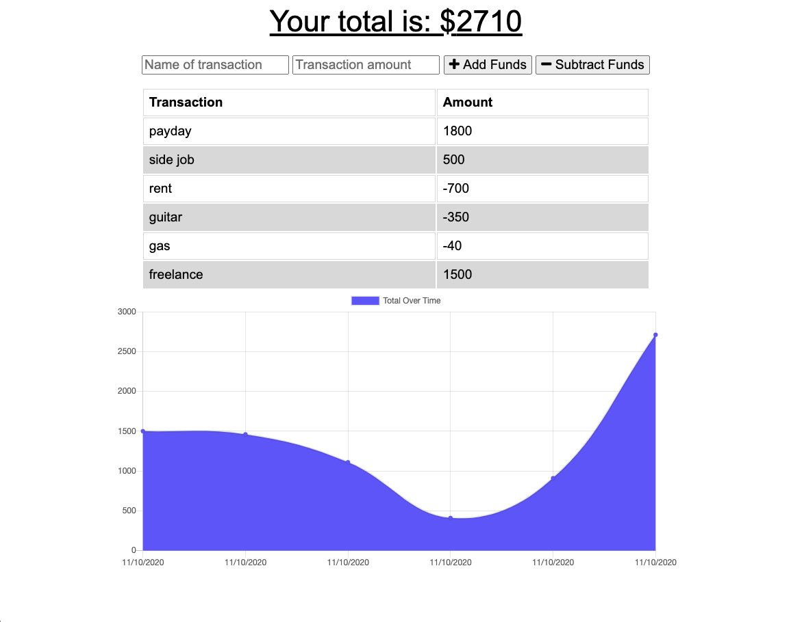

# pwa-budget-tracker

  ## Description:
  This application allows users to add expenses and deposits to their budget with or without an online connection using Progressive Web Application (PWA).
 

 ## Installation:
  No installation required. Application is deployed through Heroku. 
  Link to application: https://pwa-budget-tracker-andres.herokuapp.com/
  ## Usage:
  When the user loads the page, they are presented with the budget tracker dashboard. The user enters their transaction and transaction amount, and can either click the 'add funds' or 'subtract funds' button. Once the user either adds or subtracts an expense, the transaction object will dynamically appear on a chart using chart.js.
  ## Contribution
  Andres Roldan
 
## Questions
  For more questions about the Generator, please contact me at:
  
  * [Github Profile](http://github.com/dresroldan)
  * dresroldan@gmail.com
      
  